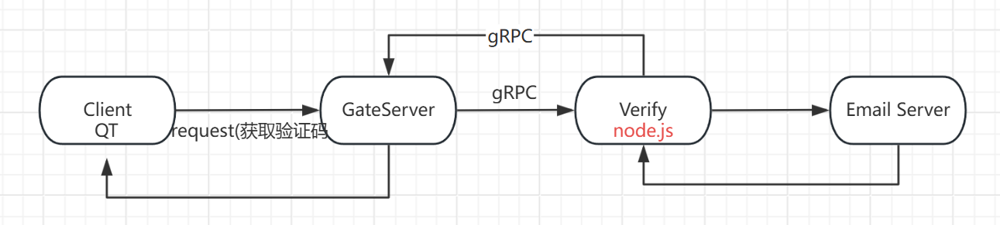

## 逻辑

grpc客户端实现之后，用`node.js`构建grpc的server，收到grpc客户端的请求，向指定邮箱发送一封邮件，发送成功的response返回给客户端




## 环境

[官网](https://nodejs.org/zh-cn)下载安装一路next


在`chat/Server`下新建文件夹`VerifyServer`并且执行`npm init`

package设为verifyserver

- 安装grpc包`npm install @grpc/grpc-js`
- 安装grpc解析库，grpc在js可以动态解析`proto`，`npm install @grpc/proto-loader`
- 安装发送邮件的包，`npm install nodemailer`

把`GateServer`下的`message.proto`复制，并新建`proto.js`用于解析`proto`


## SMTP服务

开启163邮箱的IMAP/SMTP服务，授权码LTkZG8GV8PpZyG7A用于发送邮件

在`/Server/VerifyServer`下新建`config.json`

```json
{
    "email": {
        "user": "q510655254@163.com",
        "pass": "LTkZG8GV8PpZyG7A"
    }
}
```

新建`const.js`包含全局变量和常量

新建`config.js`用来读取配置

新建`email.js`用来发送邮件

```js
function SendMail(mailOptions_){
    return new Promise(function(resolve, reject){
        transport.sendMail(mailOptions_, function(error, info){
            if (error) {
                console.log(error);
                reject(error);
            } else {
                console.log('邮件已成功发送：' + info.response);
                resolve(info.response)
            }
        });
    })
}
```

这里的设计，`sendMail()`是一个异步回调，调用之后直接返回，此时不见得邮件发送成功（邮件是否发送成功通过回调通知）

通过`Promise`获得一个“未来的结果”可以阻塞。


## 不足

- 验证码需要时效性
- `GateServer`http线程不安全
