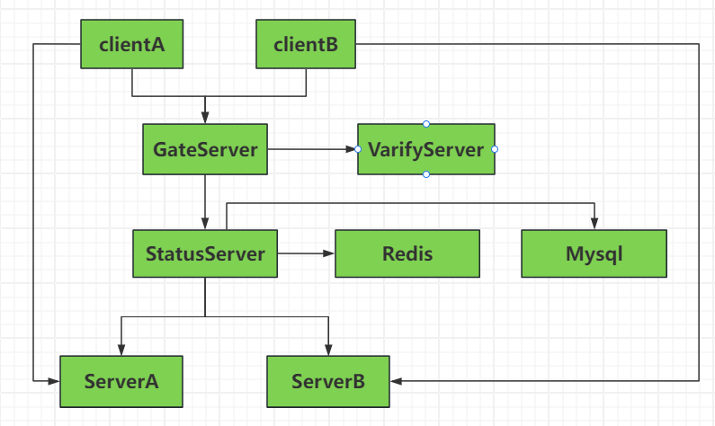

### 简介

C++全栈聊天项目实战

> 出自bilibili 恋恋风辰zack
>
> [代码](https://gitee.com/secondtonone1/llfcchat)
>
> [文档](https://gitbookcpp.llfc.club/sections/cpp/project/day01.html)

- C端QT界面编程
- asio异步服务器设计（Sever与Client之间），TCP
- beast网络库搭建http网关
- node.js搭建验证服务
- 服务器之间用grpc通信

1. GateServer为网关服务，主要应对客户端的**连接和注册**请求，服务器是是分布式，所以GateServer收到用户连接请求后会查询**状态服务**选择一个负载较小的Server地址给客户端，客户端拿着这个地址直接和Server通信建立**长连接**。
2. 用户注册时会发送给GateServer，调用VarifyServer验证注册的合理性，并发送验证码给客户端，客户端拿到验证码去GateServer注册
3. StatusServer，ServerA、ServerB都可以直接访问Redis和Mysql服务